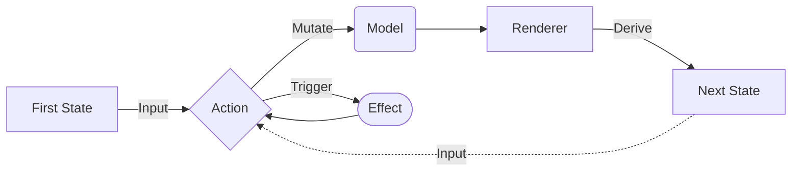

# Hurok

This is a framework library for developing applications on the JVM based on the unidirectional dataflow model.

## Parts

| Name     | Description                                                     |
|----------|-----------------------------------------------------------------|
| Model    | Holds data for business logic                                   |
| State    | UI state derived from the `Model`                               |
| Renderer | Uses the `Model` to create `State`                              |
| Action   | Mutates the `Model` and can trigger (any) `Effect`              |
| Effect   | Does background work and triggers (any) `Action`                |
| Loop     | Renders `Model` into `State` and executes `Action` and `Effect` |

## Example code

For code samples please see [Othello for Android](https://github.com/atomgomba/othello).
