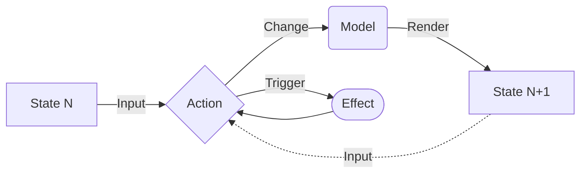

# Hurok

This is a framework library for developing applications on the JVM based on the unidirectional dataflow model. 

```mermaid
flowchart LR
    A[State N] -->|Input| B{Action} -->|Change| C(Model) -->|Render| D[State N+1] -.->|Input| B
    B -->|Trigger| E([Effect]) --> B 
```

## Parts

| Name   | Description                                                     |
|--------|-----------------------------------------------------------------|
| Model  | Holds data for business logic                                   |
| State  | UI state derived from the `Model`                               |
| Action | Mutates the `Model` and can trigger (any) `Effect`              |
| Effect | Does background work and triggers (any) `Action`                |
| Loop   | Renders `Model` into `State` and executes `Action` and `Effect` |
