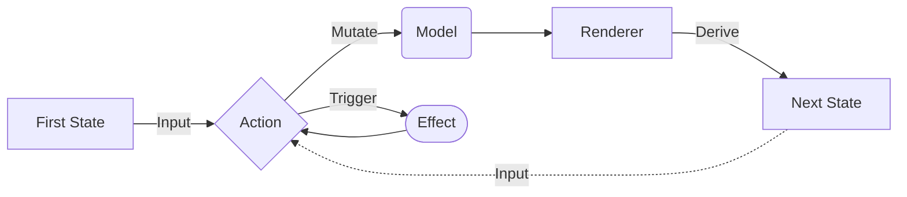

# Package com.ekezet.hurok

A multiplatform UDF-based application framework

## Parts

| Name        | Description                                        |
|-------------|----------------------------------------------------|
| [Model]     | Holds data for business logic                      |
| [ViewState] | UI state derived from the `Model`                  |
| [Renderer]  | Uses the `Model` to create new `State` for the UI  |
| [Action]    | Mutates the `Model` and can trigger (any) `Effect` |
| [Effect]    | Does background work and triggers (any) `Action`   |
| [Loop]      | Handles `Action` and `Effect`                      |

# Package com.ekezet.hurok.test

# Utilities for library testing

Contains a general [Loop](com.ekezet.hurok.Loop) implementation (the [TestLoop]) and other tools for testing.
